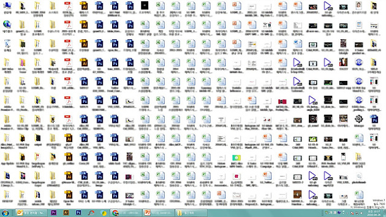

# VCS(Version control System)

## 버전관리
의미있는 변화 및 기능개선, 버그 수정등 수정사항에 대한 변화들을 관리하는 것을 말합니다.

---

## `버전(version)` 은 구체적인 한 단어로 명시하기는 힘들지만 의미있는 변화 또는 그 변화가 적용된 상태라고 할 수 있습니다.

## `버전관리 시스템`은 `버전(version)`을 관리하는 체계, 즉 파일의 변화를 시간에 따라 기록했다가 나중에 특정 시점의 버전을 다시 꺼내올 수 있는 시스템입니다.

 

---

# 협업

## 하나의 프로젝트는 마치 배와도 같다.

## 한 번쯤은 사용해봤을 법한 툴, OO드라이브

## 어느샌가 쌓여버린 수많은 파일들

---

# 왜 사용하는가?

- 명확한 작업 내용 정리 및 기록
- 프로젝트에 참여하는 구성원간의 혼란 방지
- 프로젝트 공유 및 관리

---

